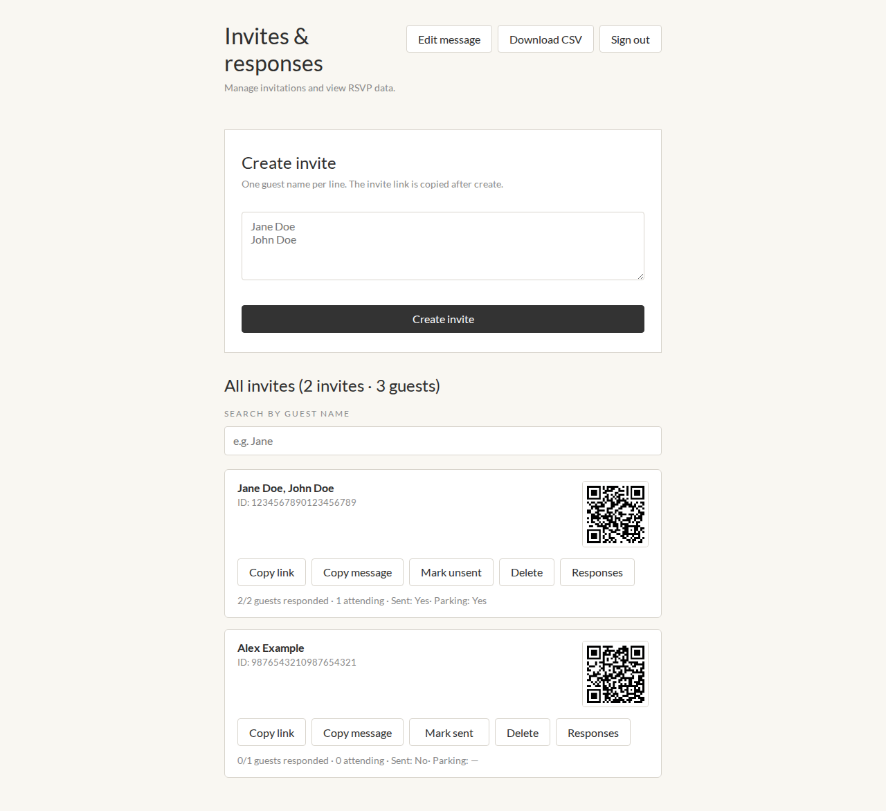
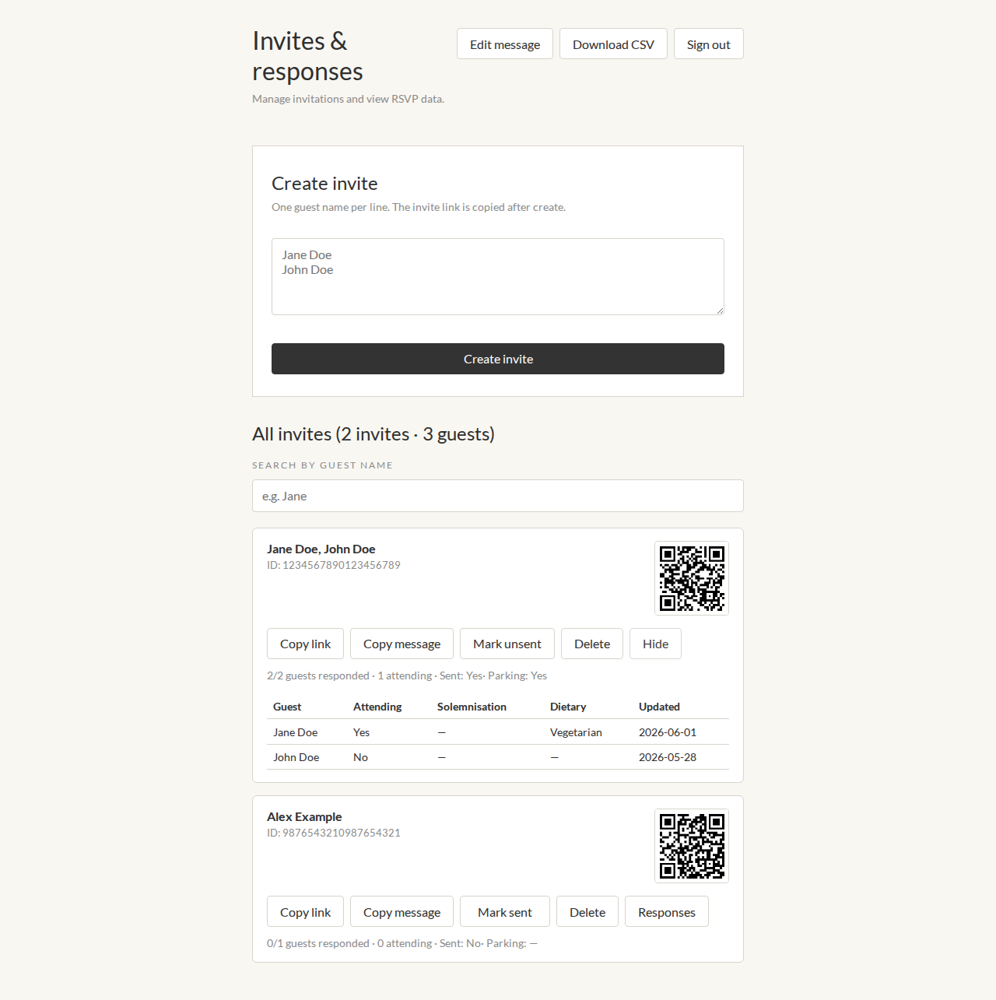
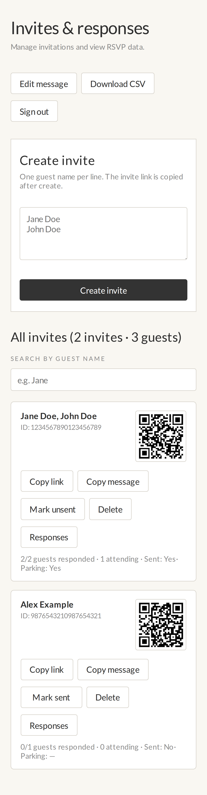
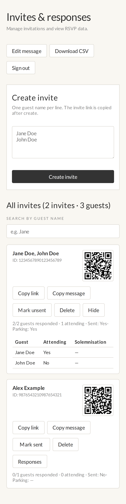

# Wedding RSVP

Go Lambda API + React SPA for wedding RSVPs. One invite can include multiple guests.

- **Backend:** Go container image on AWS Lambda
- **Frontend:** React SPA on S3 + CloudFront
- **Database:** Remote MySQL (`invites`, `guests` tables — populated separately)

---

## API

Base URL: your API Gateway URL, e.g. `https://abc123.execute-api.ap-southeast-1.amazonaws.com`

### Endpoint list

#### Public — guest RSVP (no authentication)

| Method | Path | Description |
|--------|------|-------------|
| `GET` | `/guest?id={invite_id}` | Load invite and all guests |
| `POST` | `/guest` | Save RSVP (guest update, invite update, or decline all — see body shape below) |
| `OPTIONS` | `/guest` | CORS preflight |

#### Admin — login or bearer token

| Method | Path | Auth | Description |
|--------|------|------|-------------|
| `POST` | `/admin/login` | None | Sign in; returns bearer token |
| `OPTIONS` | `/admin/login` | None | CORS preflight |
| `GET` | `/admin/invites` | Bearer | List all invites with guests and RSVP responses |
| `GET` | `/admin/invites?id={invite_id}` | Bearer | Get one invite |
| `POST` | `/admin/invites` | Bearer | Create invite and guests |
| `PATCH` | `/admin/invites` | Bearer | Update invite (`is_sent`) or guest name (`guest_id` + `name`) |
| `DELETE` | `/admin/invites?id={invite_id}` | Bearer | Delete invite and its guests |
| `OPTIONS` | `/admin/invites` | None | CORS preflight |
| `PATCH` | `/admin/guests` | Bearer | Update a guest's name |
| `OPTIONS` | `/admin/guests` | None | CORS preflight |

Admin requests (except login) send `Authorization: Bearer {token}` from `POST /admin/login`. Credentials are `ADMIN_USERNAME` and `ADMIN_PASSWORD` on Lambda.

---

### GET /guest

Load an invite and its guests by snowflake invite id.

**Query parameters**

| Param | Required | Description |
|-------|----------|-------------|
| `id` | yes | Invite id (snowflake) |

**Example**

```bash
curl "https://YOUR_API_URL/guest?id=1234567890123456789"
```

**200 OK**

```json
{
  "id": "1234567890123456789",
  "require_parking": true,
  "last_updated": "2026-06-01",
  "guests": [
    {
      "id": 1,
      "name": "Jane Doe",
      "is_attending": true,
      "attend_solemnisation": true,
      "dietary_restriction": "Vegetarian",
      "last_updated": "2026-06-01"
    },
    {
      "id": 2,
      "name": "John Doe"
    }
  ]
}
```

Null fields (`require_parking`, `is_attending`, `attend_solemnisation`, `dietary_restriction`, `last_updated`) are omitted from the response.

**Errors**

| Status | Body | Cause |
|--------|------|-------|
| `400` | `{"error":"id is required"}` | Missing `id` query param |
| `404` | `{"error":"invite not found"}` | Invite id not in database |
| `500` | `{"error":"failed to load invite"}` | Database error |

---

### POST /guest

Save RSVP data. The handler routes by request body:

- Body contains `"decline_all": true` → **decline all guests** for the invite
- Body contains `require_parking` → **invite update**
- Otherwise → **guest update**

RSVP submissions are rejected with **403** at or after **11 September 2026 00:00** (Asia/Singapore). `GET /guest` remains available so guests can still open their invite link.

#### Decline all guests

**Request body**

```json
{
  "id": "1234567890123456789",
  "decline_all": true
}
```

| Field | Required | Description |
|-------|----------|-------------|
| `id` | yes | Invite id (snowflake, string) |
| `decline_all` | yes | Must be `true` — marks every guest on the invite as not attending |

**200 OK** — returns the updated invite with guests (all `is_attending: false`, `dietary_restriction: ""`, `attend_solemnisation: null`). Any unset invite booleans are saved as `false`.

#### Invite update

**Request body**

```json
{
  "id": "1234567890123456789",
  "require_parking": true
}
```

| Field | Required | Description |
|-------|----------|-------------|
| `id` | yes | Invite id (snowflake, string) |
| `require_parking` | yes | Whether couple parking is required |

**Example**

```bash
curl -X POST "https://YOUR_API_URL/guest" \
  -H "Content-Type: application/json" \
  -d '{"id":"1234567890123456789","require_parking":true}'
```

**200 OK** — returns the updated invite with guests (same shape as GET).

**Errors**

| Status | Body | Cause |
|--------|------|-------|
| `403` | `{"error":"rsvp has closed"}` | RSVP cutoff passed (11 Sep 2026 00:00 Asia/Singapore) |
| `400` | `{"error":"id is required"}` | Missing invite id |
| `400` | `{"error":"require_parking is required"}` | Missing parking field |
| `404` | `{"error":"invite not found"}` | Invite id not in database |

#### Guest update

**Request body**

```json
{
  "id": 1,
  "is_attending": true,
  "attend_solemnisation": true,
  "dietary_restriction": "Vegetarian"
}
```

| Field | Required | Description |
|-------|----------|-------------|
| `id` | yes | Guest id (integer) |
| `is_attending` | yes | `true` = attending, `false` = declining |
| `attend_solemnisation` | yes* | Whether attending the solemnisation |
| `dietary_restriction` | no | Dietary needs; omit or send `""` if none (stored as empty string, never `null`) |

\* Required when `is_attending` is `true`. Cleared to `null` when declining.

After any save, nullable RSVP fields are persisted as concrete values: booleans as `true`/`false`, text as `""`.

**Example**

```bash
curl -X POST "https://YOUR_API_URL/guest" \
  -H "Content-Type: application/json" \
  -d '{"id":1,"is_attending":true,"attend_solemnisation":true,"dietary_restriction":"Vegetarian"}'
```

**200 OK**

```json
{ "status": "saved" }
```

**Errors**

| Status | Body | Cause |
|--------|------|-------|
| `403` | `{"error":"rsvp has closed"}` | RSVP cutoff passed (11 Sep 2026 00:00 Asia/Singapore) |
| `400` | `{"error":"id is required"}` | Missing guest id |
| `400` | `{"error":"is_attending is required"}` | Missing attendance choice |
| `400` | `{"error":"attend_solemnisation is required when attending"}` | Attending guest missing solemnisation choice |
| `404` | `{"error":"guest not found"}` | Guest id not in database |

---

### POST /admin/login

**Request body**

```json
{
  "username": "admin",
  "password": "your-password"
}
```

**200 OK**

```json
{
  "token": "eyJhbGciOiJIUzI1NiJ9...",
  "expires_at": "2026-06-03T12:00:00Z"
}
```

| Status | Body | Cause |
|--------|------|-------|
| `401` | `{"error":"invalid username or password"}` | Wrong credentials |
| `503` | `{"error":"admin login is not configured"}` | `ADMIN_USERNAME` or `ADMIN_PASSWORD` not set on Lambda |

---

### GET /admin/invites

List every invite with guests and RSVP fields (`is_sent`, `require_parking`, `is_attending`, `attend_solemnisation`, `dietary_restriction`, etc.).

**Example**

```bash
curl -H "Authorization: Bearer YOUR_TOKEN" \
  "https://YOUR_API_URL/admin/invites"
```

**200 OK** — JSON array of invite objects.

**Get one invite** — same path with `?id={invite_id}`.

---

### POST /admin/invites

Create a new invite. The server generates a snowflake `id`.

**Request body**

```json
{
  "guests": ["Jane Doe", "John Doe"],
  "is_sent": false
}
```

| Field | Required | Description |
|-------|----------|-------------|
| `guests` | yes | Guest names (at least one) |
| `is_sent` | no | Whether the invite link was sent |

**201 Created**

```json
{
  "invite": {
    "id": "1234567890123456789",
    "is_sent": false,
    "guests": [{ "id": 1, "name": "Jane Doe" }]
  }
}
```

---

### PATCH /admin/invites

Update invite metadata or a guest's name.

**Invite update** — set `is_sent`:

```json
{
  "id": "1234567890123456789",
  "is_sent": true
}
```

**Guest name update** — set `guest_id` and `name` (RSVP fields are not changed). Rejected with **409 Conflict** once any guest on the same invite has submitted an RSVP (`is_attending` is set):

```json
{
  "guest_id": 1,
  "name": "Jane Smith"
}
```

| Field | Required | Description |
|-------|----------|-------------|
| `id` | yes (invite update) | Invite snowflake id |
| `is_sent` | yes (invite update) | Whether the invite was sent |
| `guest_id` | yes (name update) | Guest id |
| `name` | yes (name update) | New guest name (non-empty after trim) |

**200 OK** — updated invite object, updated guest object (name update), or `{"status":"saved"}`.

**404 Not Found** — `{"error":"invite not found"}` or `{"error":"guest not found"}`.

**409 Conflict** — `{"error":"guest names cannot be changed after an RSVP response"}` (name update only).

**Example (guest name)**

```bash
curl -X PATCH -H "Authorization: Bearer YOUR_TOKEN" \
  -H "Content-Type: application/json" \
  -d '{"guest_id":1,"name":"Jane Smith"}' \
  "https://YOUR_API_URL/admin/invites"
```

---

### PATCH /admin/guests

Update a guest's name. Same behaviour as `PATCH /admin/invites` with `guest_id` and `name`. Prefer the `/admin/invites` path in production — it uses an existing API Gateway route.

**Request body**

```json
{
  "id": 1,
  "name": "Jane Smith"
}
```

| Field | Required | Description |
|-------|----------|-------------|
| `id` | yes | Guest id |
| `name` | yes | New guest name (non-empty after trim) |

**200 OK** — updated guest object.

**404 Not Found** — `{"error":"guest not found"}`.

**409 Conflict** — `{"error":"guest names cannot be changed after an RSVP response"}`.

**Example**

```bash
curl -X PATCH -H "Authorization: Bearer YOUR_TOKEN" \
  -H "Content-Type: application/json" \
  -d '{"id":1,"name":"Jane Smith"}' \
  "https://YOUR_API_URL/admin/guests"
```

---

### DELETE /admin/invites

**Query parameters**

| Param | Required | Description |
|-------|----------|-------------|
| `id` | yes | Invite id to delete |

**Example**

```bash
curl -X DELETE -H "Authorization: Bearer YOUR_TOKEN" \
  "https://YOUR_API_URL/admin/invites?id=1234567890123456789"
```

**200 OK** — `{"status":"deleted"}`.

---

## Deployment

### Prerequisites

- AWS CLI configured with deploy permissions
- Docker with `buildx`
- ECR repository created
- Lambda function created (container image, `x86_64`, 256 MB, 30 s timeout)
- HTTP API Gateway with routes pointing to the Lambda (`make deploy-api` syncs required routes from the Makefile `API_ROUTES` list)
- S3 bucket + CloudFront distribution for the frontend
- MySQL database with `invites` and `guests` tables

### Lambda environment variables

Set these in the AWS Lambda console (or your IaC):

| Variable | Example | Description |
|----------|---------|-------------|
| `ENV` | `prod` | Must be lowercase `prod` for production CORS |
| `DB_HOST` | `your-db.example.com` | MySQL host |
| `DB_PORT` | `3306` | MySQL port |
| `DB_USER` | `rsvp_user` | MySQL user |
| `DB_PASSWORD` | `***` | MySQL password |
| `DB_NAME` | `rsvp` | Database name |
| `FRONTEND_ORIGIN` | `https://alvinandvivian.rsvp` | Primary site origin for CORS (no trailing slash) |
| `FRONTEND_ORIGINS` | *(optional)* | Extra allowed origins, comma-separated (e.g. CloudFront URL during migration) |
| `ADMIN_USERNAME` | `admin` | Admin login username |
| `ADMIN_PASSWORD` | `***` | Admin login password |
| `ADMIN_TOKEN_SECRET` | *(optional)* | Signs session tokens; defaults to `ADMIN_PASSWORD` if unset |

If MySQL is in a VPC, attach the Lambda to the same VPC/subnets/security groups and add the `AWSLambdaVPCAccessExecutionRole` policy.

### Deploy commands

```bash
# API: build Docker image → push to ECR → update Lambda
make deploy-api

# Frontend: build React app → sync to S3 → invalidate CloudFront
make deploy-frontend

# Both
make deploy
```

---

## Local development

### API

```bash
cp api/.env.example api/.env
# edit with DB credentials and TEST_INVITE_ID
cd api && go run ./cmd/local
```

### Frontend

```bash
cp frontend/.env.example frontend/.env
cd frontend && npm install && npm run dev
```

Open `http://localhost:5173/?id=YOUR_INVITE_ID`.

Admin UI: `http://localhost:5173/admin.html` — see [Admin UI](#admin-ui) (set `ADMIN_USERNAME` and `ADMIN_PASSWORD` in `api/.env` when running the API locally).

To proxy API calls through Vite during dev, set `VITE_API_PROXY_TARGET` in `frontend/.env` to your API Gateway URL and leave `VITE_API_BASE_URL` empty. The dev server proxies `/guest` and `/admin` to that target.

### Tests

```bash
make test
```

---

## Admin UI

Password-protected admin app at **`/admin.html`** on the deployed site (e.g. `https://alvinandvivian.rsvp/admin.html`) or locally at `http://localhost:5173/admin.html`. It uses the admin API (`POST /admin/login`, `/admin/invites`, `/admin/guests`) documented above.

Sign in with `ADMIN_USERNAME` and `ADMIN_PASSWORD` (Lambda env vars, or `api/.env` when running the API locally). The session token is stored in `sessionStorage` for the browser tab.

### What you can do

| Area | Actions |
|------|---------|
| **Create invite** | Enter guest names (one per line); the server assigns a snowflake id and the RSVP link is copied to the clipboard after create |
| **Invite list** | Search by guest name; see counts of invites and guests |
| **Per invite** | QR code for the RSVP link, **Copy link**, **Copy message** (uses the template below), **Mark sent** / **Mark unsent**, **Delete**, **Responses** (expand RSVP table) |
| **Guest names** | In **Responses**, use **Edit** next to a guest name to rename them (disabled once any guest on that invite has responded) |
| **Message template** | **Edit message** — customize the WhatsApp/SMS-style invite text stored in `localStorage`; placeholders `[Names]` and `[Link]` are replaced per invite |
| **Export** | **Download CSV** — one row per guest with invite id, sent/parking flags, attendance, solemnisation, dietary needs, and timestamps |
| **Session** | **Sign out** clears the stored token |

Expanded **Responses** shows attending, solemnisation, dietary, and last-updated per guest. Guest names can be edited inline from this table until any guest on the invite has responded. Summary lines show responded/attending counts plus sent and parking status.

### Screenshots

Captured with mocked invite data (`npm run screenshots` in `frontend/`; see [Project layout](#project-layout)). Production data will differ.

**Desktop (1280px)**

| Invite list | Responses expanded |
|-------------|-------------------|
|  |  |

**Mobile (~390px)**

| Invite list | Responses expanded |
|-------------|-------------------|
|  |  |

---

## Database schema

Database: `rsvp` (populated separately).

### `invites`

| Column | Type |
|--------|------|
| `id` | snowflake |
| `is_sent` | boolean |
| `require_parking` | boolean |
| `last_updated` | datetime, default `NOW()` |

### `guests`

| Column | Type |
|--------|------|
| `id` | auto incremental (`AUTO_INCREMENT`) |
| `invite_id` | foreign key → `invites.id` |
| `name` | text |
| `dietary_restriction` | text |
| `is_attending` | boolean |
| `attend_solemnisation` | boolean |
| `last_updated` | datetime, default `NOW()` |

One invite (`invites.id`) can have many guests (`guests.invite_id`).

The public API reads and updates `require_parking` on invites, and `attend_solemnisation`, `is_attending`, and `dietary_restriction` on guests. Admin routes can create/delete invites and update `is_sent`.

### Example MySQL DDL

```sql
CREATE TABLE invites (
  id BIGINT UNSIGNED NOT NULL,
  is_sent BOOLEAN NULL,
  require_parking BOOLEAN NULL,
  last_updated TIMESTAMP NULL DEFAULT CURRENT_TIMESTAMP ON UPDATE CURRENT_TIMESTAMP,
  PRIMARY KEY (id)
);

CREATE TABLE guests (
  id INT NOT NULL AUTO_INCREMENT,
  invite_id BIGINT UNSIGNED NOT NULL,
  name TEXT NOT NULL,
  dietary_restriction TEXT NULL,
  is_attending BOOLEAN NULL,
  attend_solemnisation BOOLEAN NULL,
  last_updated TIMESTAMP NULL DEFAULT CURRENT_TIMESTAMP ON UPDATE CURRENT_TIMESTAMP,
  PRIMARY KEY (id),
  FOREIGN KEY (invite_id) REFERENCES invites (id)
);
```

---

## Project layout

```text
.
├── api/           # Go Lambda (handler, store, config)
├── docs/
│   └── readme/    # Images committed for README (admin UI screenshots)
├── frontend/      # React + Vite SPA (`index.html` landing + RSVP popup, `admin.html` admin)
│   └── public/
│       ├── original/  # Source PNG/GIF illustrations (masters)
│       └── images/    # Web-optimized copies (WebP + optimized GIF, sprite metadata)
├── Dockerfile     # Lambda container image
├── Makefile       # Build and deploy commands
└── INSTRUCTIONS.md  # Repo rules — keep README in sync with API/deploy changes
```

Regenerate UI screenshots locally (written to gitignored `docs/screenshots/` by default):

```bash
cd frontend
npm ci && npm run build && npx playwright install chromium && npm run screenshots
```

Copy updated admin images into `docs/readme/admin/` when refreshing the README screenshots.

Wedding copy (couple names, date, venue) is in `frontend/src/constants.js`.
