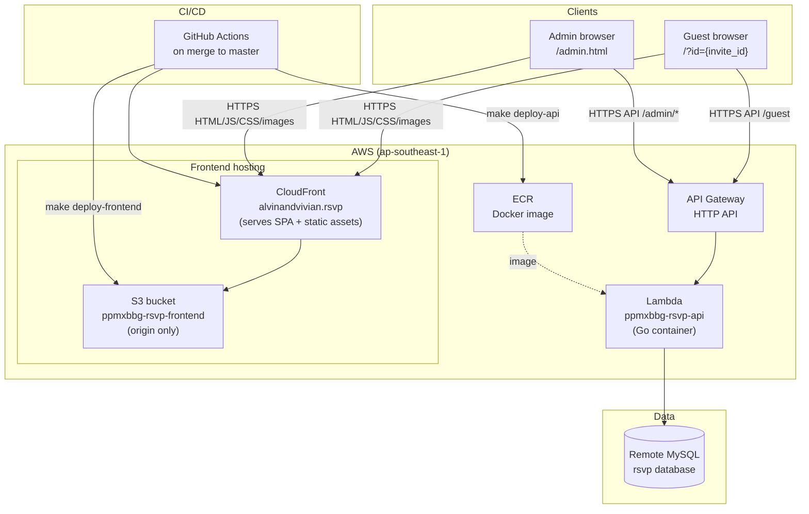
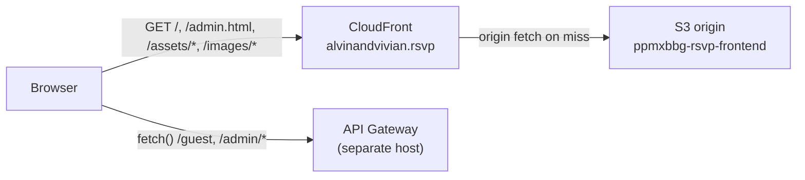
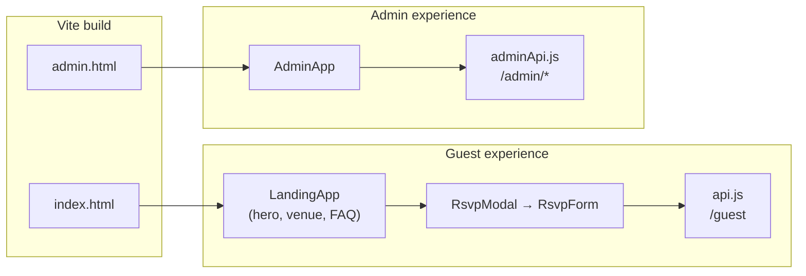
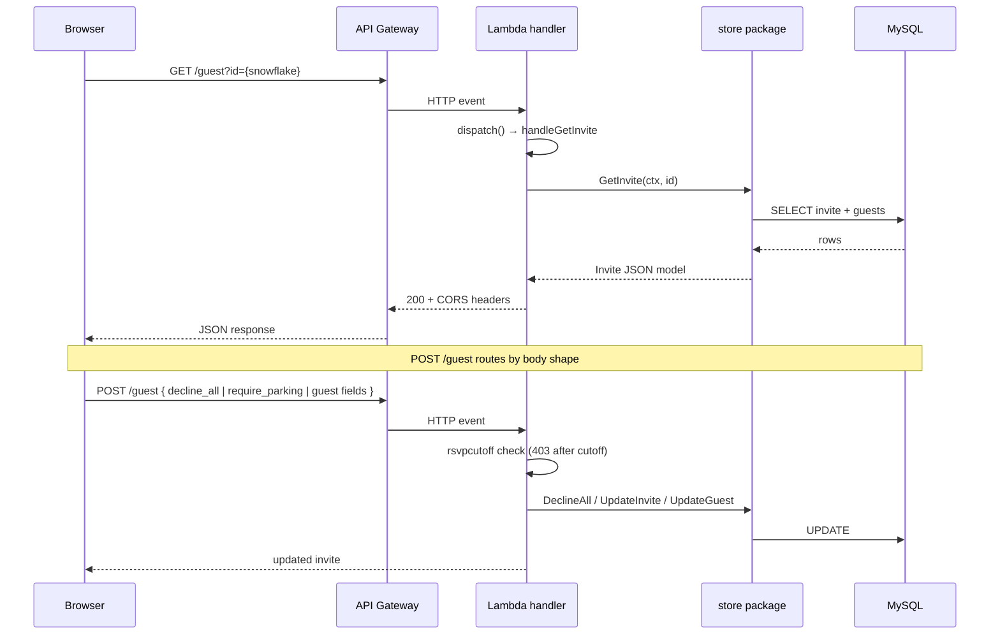
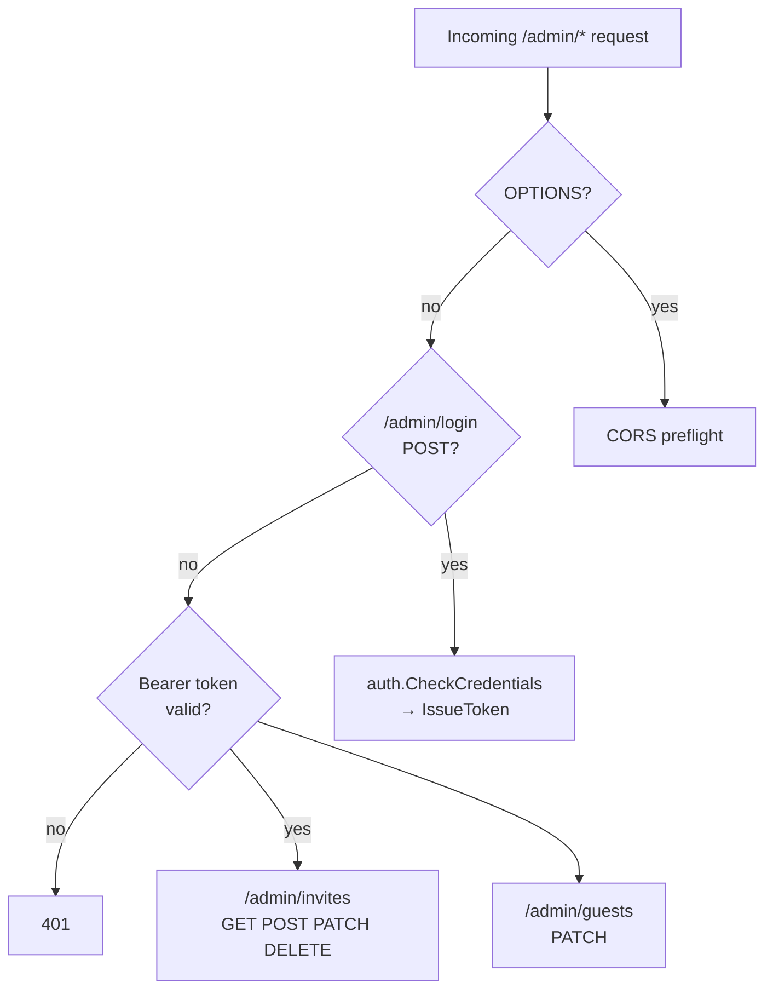
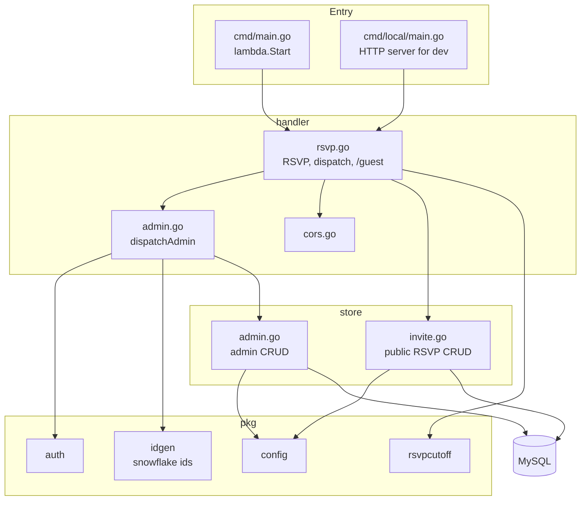
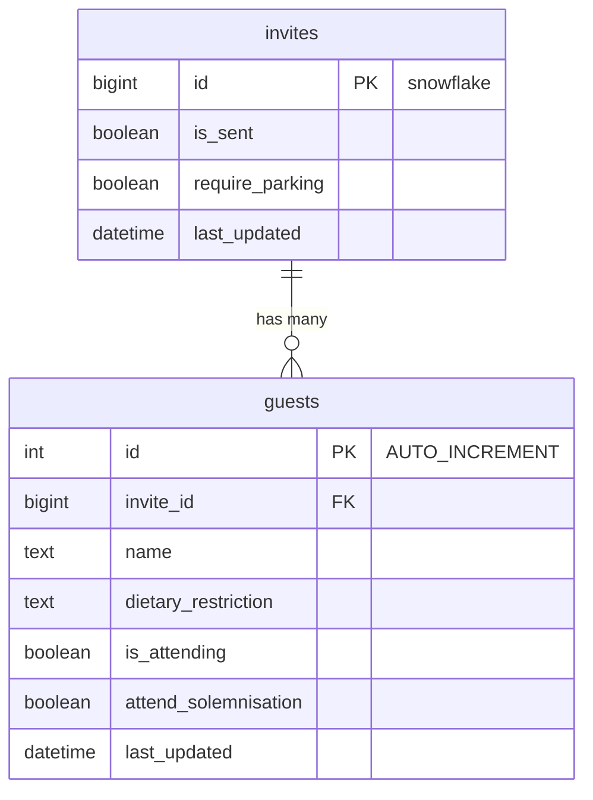
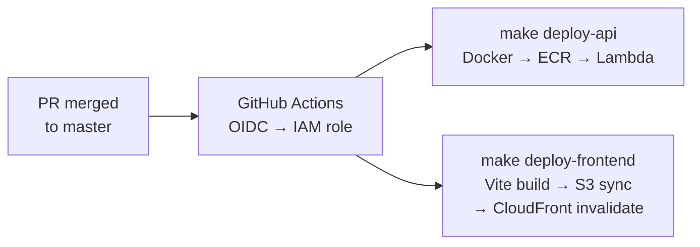

# Architecture

Wedding RSVP application: a Go Lambda API backed by MySQL, with a React SPA served through **CloudFront** (S3 is the origin only — browsers do not hit S3 directly). Guests open personalized invite links; admins manage invites through a separate SPA entry point.

---

## System overview

| Layer | Technology | Role |
|-------|------------|------|
| Frontend | React 18 + Vite | Guest landing page, RSVP modal, admin UI |
| CDN / hosting | CloudFront → S3 | CloudFront serves the SPA and static assets on the custom domain; S3 is the private origin |
| API | API Gateway HTTP API | Routes to Lambda, CORS |
| Compute | AWS Lambda (container) | Single Go handler for all routes |
| Database | MySQL | `invites` and `guests` tables |
| Deploy | Makefile + GitHub Actions | OIDC to AWS on PR merge |

---

## Frontend applications

### Production delivery

In production, all frontend traffic goes through CloudFront. The built SPA (`frontend/dist`) is synced to S3; CloudFront fetches from S3 on cache miss and serves `index.html`, `admin.html`, hashed `/assets/*`, and `/images/*` to browsers.

### Vite entry points

Vite builds two HTML entry points from the same `frontend/` tree:

| Entry | URL | Purpose |
|-------|-----|---------|
| `index.html` | `https://alvinandvivian.rsvp/` or `/?id=…` | Wedding landing page; RSVP opens in a modal when `?id=` is present |
| `admin.html` | `https://alvinandvivian.rsvp/admin.html` | Password-protected invite management, CSV export, QR codes |

Both URLs are served by CloudFront (same distribution, S3 origin).

Local dev: Vite can proxy `/guest` and `/admin` to a remote API when `VITE_API_PROXY_TARGET` is set.

---

## API request flow

All traffic hits one Lambda function (`handler.RSVP`). It parses API Gateway v1 or v2 events, applies CORS, and dispatches by path.

### Public routes (`/guest`)

| Method | Handler | Store |
|--------|---------|-------|
| `GET /guest` | Load invite by snowflake id | `store.GetInvite` |
| `POST /guest` | Decline all, invite update, or guest update | `store.DeclineAllGuests`, `UpdateInvite`, `UpdateGuest` |

POST routing is determined by request body: `decline_all: true` → decline all guests; presence of `require_parking` → invite update; otherwise → guest update. Submissions are rejected with **403** after the RSVP cutoff (11 Sep 2026, Asia/Singapore); GET remains available.

### Admin routes (`/admin/*`)

Admin session tokens are HMAC-signed JWT-like payloads (`pkg/auth`), 24-hour TTL, stored in browser `localStorage`.

---

## Backend package layout

---

## Data model

One invite row maps to one RSVP link (`/?id={invite_id}`). Guest names and RSVP responses are stored per guest row. Admin creates invites (assigning snowflake ids) and tracks `is_sent`; guests update attendance, solemnisation, dietary needs, and parking.

---

## Deployment pipeline

| Target | Makefile target | Artifacts |
|--------|-----------------|-----------|
| API | `deploy-api` | `Dockerfile` multi-stage build → ECR → `lambda update-function-code` |
| Frontend | `deploy-frontend` | `frontend/dist` → S3; CloudFront cache invalidation |
| Both | `deploy` | Runs API then frontend |

API Gateway routes are defined in the Makefile (`API_ROUTES`) and created manually via `make api-gateway-routes` when new paths are added.

---

## Environment and configuration

| Component | Key variables |
|-----------|----------------|
| Lambda | `DB_*`, `ENV`, `FRONTEND_ORIGIN(S)`, `ADMIN_USERNAME`, `ADMIN_PASSWORD`, `ADMIN_TOKEN_SECRET` |
| Frontend build | `VITE_API_BASE_URL` (baked in at build time) |
| Local API | `api/.env` (from `api/.env.example`) |
| Local frontend | `frontend/.env` — optional `VITE_API_PROXY_TARGET` for dev proxy |

Lambda may run inside a VPC when MySQL is network-restricted (`AWSLambdaVPCAccessExecutionRole`).
